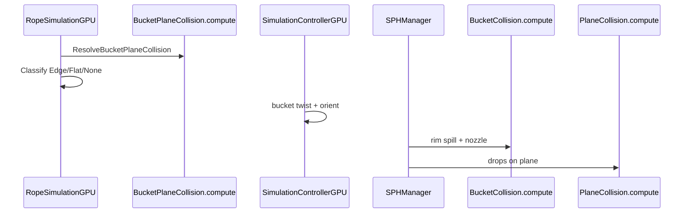

# Bucket–Plane Contact, Twist & Spill Guide

دليل **Bucket vs Plane** — اصطدام الدلو بالسطح، الدوران (twist)، السهم على الحبل، وانسكاب الدهان على GPU.

راجع أيضاً: [SURFACE_COLLISION_GUIDE.md](SURFACE_COLLISION_GUIDE.md) لاصطدام الجسيمات بالسطح.

---

## 1. الفكرة

| الحالة | ماذا يحدث |
|--------|-----------|
| **None** | الدلو معلّق — سكب من الفوهة فقط |
| **Edge** | حافة الدلو تلمس السطح — **rim spill** من الجانب المنخفض |
| **Flat** | قاع الدلو على السطح — الفوهة مسدودة، فيضان من الحافة إن امتلأ |

---

## 2. معادلة المستوي (مشتركة مع الدهان)

```
signedDistance = dot(point - planePosition, planeNormal)
```

- `signedDistance < skin` → الدلو يلامس السطح
- **Edge vs Flat**: من زاوية `bucketUp` مع `planeNormal`
  - `|dot| > 0.6` → **Flat** (قاع)
  - غير ذلك → **Edge** (حافة)

---

## 3. GPU Flow



| خطوة | أين | التكلفة |
|------|-----|---------|
| Rope vs plane | 1 dispatch (thread واحد) | منخفضة |
| Rim spill | فرع داخل `ResolveBucketCollision` | منخفضة |
| Twist | float واحد / frame | صفر GPU إضافي |
| Arrow | 1 LineRenderer | 1 draw call |

---

## 4. الدوران (Twist / Roll)

- **`twistAngleDegrees`** على `BucketVolume` — دوران الدلو حول محور الحبل (`bucket.up`).
- **إدخال**: بعد اختيار الدلو — **Q / E** أو **عجلة الفأرة**.
- يؤثر على:
  - اتجاه الدلو البصري
  - **اتجاه rim spill** عبر `bucketTwistAngle` في الـ shader

---

## 5. السهم على الحبل (`RopeTwistArrowRenderer`)

- يوضع عند ~**80%** من طول الحبل باتجاه الدلو.
- يشير إلى **اتجاه السكب** (`bucket.forward` بعد الـ twist).
- يُحدَّث في `LateUpdate` — لا readback إضافي للجسيمات.

**قراءة السهم:** رأس السهم = الجهة التي يميل الدلو للسكب منها عند الإمالة أو الاصطدام.

---

## 6. معاملات `BucketVolume`

### Plane Contact
| Parameter | الوصف |
|-----------|--------|
| `planeCollisionBounce` | ارتداد جسم الدلو عن السطح |
| `planeCollisionFriction` | احتكاك انزلاق الدلو على السطح |
| `planeCollisionSkin` | هامش قبل التلامس |
| `planeMaxBounceSpeed` | حد أقصى لسرعة الارتداد |

### Rim Spill
| Parameter | الوصف |
|-----------|--------|
| `spillTiltDegrees` | أقل إمالة تبدأ السكب من الحافة (~35°) |
| `rimSpillSpeed` | سرعة خروج الدهان من الحافة |
| `rimSpillFillFraction` | ارتفاع ملء الدلو قبل السماح بالفيضان (0–1) |
| `rimSpillParticlesPerSecond` | معدل جسيمات الفيضان |

### Twist
| Parameter | الوصف |
|-----------|--------|
| `twistAngleDegrees` | زاوية الدوران الحالية (يُحدَّث من اللعب) |

---

## 7. الملفات

| ملف | الدور |
|-----|-------|
| `Assets/Resources/BucketPlaneCollision.compute` | اصطدام نهاية الحبل + الدلو بالمستوي |
| `Assets/Scripts/Physics/BucketPlaneContact.cs` | تصنيف None / Edge / Flat |
| `Assets/Scripts/Physics/RobeSimulationGPU.cs` | dispatch + contact mode |
| `Assets/Shaders/BucketCollision.compute` | nozzle + rim spill |
| `Assets/Scripts/Rendering/RopeTwistArrowRenderer.cs` | سهم الاتجاه |
| `Assets/Scripts/Core/SimulationControllerGPU.cs` | twist + rope/plane wiring |
| `Assets/Scripts/Input/BucketDragController.cs` | Q/E + scroll twist |

---

## 8. الاختبار

1. **SwingPaintBucket** → Play → أرجح الدلو ليلامس السطح بزاوية → rim spill من الجانب المنخفض.
2. ضع الدلو مسطحاً على السطح → الفوهة تتوقف، فيضان من الحافة إن كان ممتلئاً.
3. اختر الدلو → **Q/E** أو scroll → السهم يدور، اتجاه السكب يتغير.
4. اسحب الدلو بعيداً → سكب الفوهة يعود طبيعياً.

---

## 9. ضبط سريع

| تريد | عدّل |
|------|------|
| فيضان أقوى عند الحافة | ↑ `rimSpillSpeed`, ↑ `rimSpillParticlesPerSecond` |
| سكب أبكر عند الإمالة | ↓ `spillTiltDegrees` |
| ارتداد أخف للدلو | ↓ `planeCollisionBounce` |
| دوران أسرع | ↑ `twistSpeed` في `BucketDragController` |
