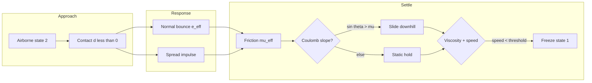
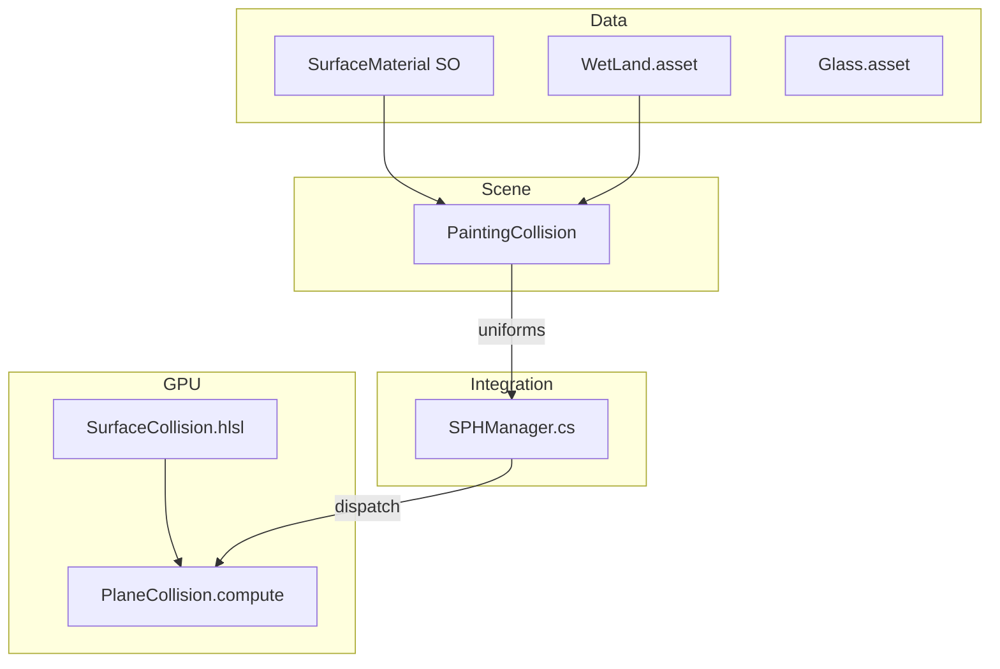
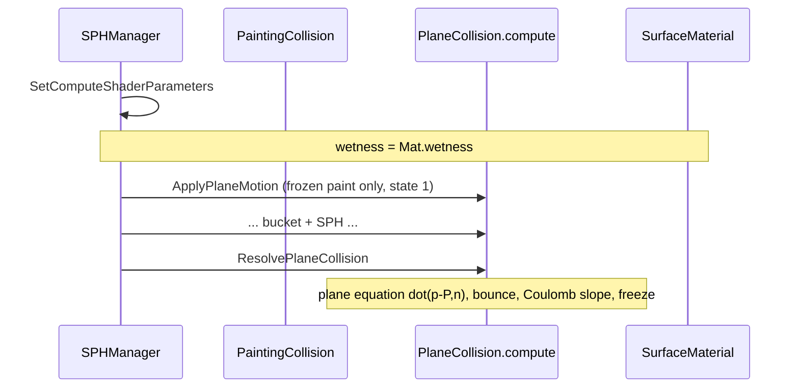

# Surface Collision Guide — ارتطام السائل بالسطح

دليل لقسم **Plane Surface Collision** في مشروع Swing Paint Bucket.  
من الفكرة → الفيزياء → الكود → الاختبار.

**اصطدام الدلو بالسطح + twist + spill:** راجع [BUCKET_PLANE_SPILL_GUIDE.md](BUCKET_PLANE_SPILL_GUIDE.md).

---

## 1. ملخص في 30 ثانية

**One-liner:** كل مادة سطح (زجاج، خشب، WetLand…) لها شخصية فيزيائية — bounce، friction، spread، wetness — والجسيمات تتفاعل مع المستوي عبر **معادلة المستوي** على GPU.

### 3 أفكار للتذكر

| # | جملة |
|---|------|
| 1 | **المسافة الموقّعة** تقول: فوق السطح ولا تحت؟ |
| 2 | **العمودي يرتد × e**، **المماسي ينزلق × (1−μ)** |
| 3 | **الميل + الاحتكاك** يتحسبان من الفيزياء — بدون slider منفصل لل slope |

---

## 2. الفيزياء — القوانين بأسمائها

> نموذج **phenomenological** مُبسّط للـ real-time. مبني على قوانين حقيقية، لكنه ليس CFD كامل.

| القانون / المفهوم | الاسم بالإنجليزية | المعادلة | أين في الكود |
|-------------------|-------------------|----------|--------------|
| معادلة المستوي | **Plane Equation** (Hesse form) | `d = (P − P₀) · n̂` | `SurfaceCollision.hlsl` |
| تحليل المتجه | **Vector Decomposition** | `v = v_n + v_t` | `ResolveSurfacePlaneCollision()` |
| معامل الارتداد | **Coefficient of Restitution** | `v_n' = −e_eff · v_n` | `restitution`, `absorption` |
| احتكاك كولوم | **Coulomb Friction Model** | `v_t' = v_t(1−μ)` | `staticFriction`, `dynamicFriction` |
| رطوبة تقلّل الاحتكاك | **Wet Lubrication** | `μ_eff = μ · (1 − α·W)` | `wetness`, `wetnessSlideFactor` |
| انزلاق على الميل | **Coulomb Slope Criterion** | slide if `sin θ > μ·cos θ` | من `plane.up` + friction |
| تسارع على الميل | **Inclined Plane** | `a = g(sin θ − μ cos θ)` | `SurfaceCollision.hlsl` |
| تخميد أسي | **Exponential Damping** | `v_t *= exp(−η·dt)` | `paintViscosity` |
| انتشار عشوائي | **Stochastic Splash** | `Δv_t ~ spread · \|v\|` | `spread` |
| امتصاص | **Energy Absorption** | `e_eff = e · (1 − absorption)` | `absorption` |

---

## 3. SurfaceMaterial — كل الـ Parameters (9 فقط)

**كل التعديل على Material** — `PaintingCollision` = مراجع فقط (plane + material).

### Impact

| Parameter | المعنى |
|-----------|--------|
| **restitution** | Bounce strength on impact — `v_n' = −e · v_n` |
| **absorption** | Damps tangential splash on impact (does not reduce normal bounce) |
| **staticFriction** | احتكاك سكون (Coulomb) |
| **dynamicFriction** | احتكاك حركة (Coulomb) |
| **spread** | انتشار عشوائي عند الضرب = `spread × impactSpeed` |

### Wetness

| Parameter | المعنى |
|-----------|--------|
| **wetness** | **رطوبة جو ثابتة** — ambient (0 = جاف، 1 = مبلول دائماً) |
| **wetnessSlideFactor** | كم الرطوبة تقلّل الاحتكاك: `μ × (1 − factor × wetness)` |

### Slide & Settle

| Parameter | المعنى |
|-----------|--------|
| **paintViscosity** | لزوجة الدهان على السطح — يبطّئ الانزلاق |
| **stopSpeedThreshold** | تحت هالسرعة → الجسيم **يتجمّد** |

**الميل:** من **Transform → Rotation** على الـ plane — **ما في** `slopeSlideGain`.

---

## 4. دورة حياة الجسيم



### ParticleState

| State | المعنى | SPH | Plane collision |
|-------|--------|-----|-----------------|
| `0` | داخل الدلو | نعم | لا |
| `2` | ساقط / في الهواء | gravity + viscosity | impact كامل |
| `1` | على السطح | **نعم** (pressure + viscosity) | slide + constrain |

---

## 5. الرطوبة — ambient فقط (بدون deposit)

**ما في** `wetnessDepositPerContact` ولا `dryRate` — الرطوبة **ثابتة** من `material.wetness`.

```
μ_eff = μ · (1 − wetnessSlideFactor · material.wetness)
```

| wetness | wetnessSlideFactor | النتيجة |
|---------|-------------------|---------|
| 0 | أي | جاف — احتكاك كامل |
| 0.8 | 0.9 | مبلول — ينزلق كثير (زجاج مبلول) |
| 0 | 0.55 | WetLand جاف — احتكاك عادي |

`Surface Wetness Display` على `PaintingCollision` = **read-only** mirror لـ `material.wetness`.

---

## 6. انزلاق على الميل — تلقائي

```
sin θ = |g_parallel| / |g|        ← من plane.up
cos θ ≈ |planeNormal · up|

إذا sin θ > μ_eff  →  ينزلق:  a = g(sin θ − μ_eff · cos θ)
إذا sin θ ≤ μ_eff  →  يتوقف (احتكاك سكوني يمسك)
```

**للتجربة:** Plane Rotation X ≈ 15° + Glass (μ منخفض) → ينزل لتحت.  
**WetLand** (μ ≈ 0.45): على ~10° ميل **ما ينزلق** من الجاذبية — Coulomb يمسكه.

---

## 7. مخطط المعمارية



### خارج هذا القسم

- `SPHSimulation.compute` — SPH داخل الدلو
- `BucketCollision.compute` — الدلو والفوهة
- `RopeSimulationGPU` — الحبل

---

## 8. خريطة الملفات

| ملف | الدور |
|-----|-------|
| `Assets/Scripts/Data/SurfaceMaterial.cs` | 9 parameters للمادة |
| `Assets/SciptableObjects/*.asset` | Presets: Glass, Wood, Paper, WetLand |
| `Assets/Scripts/Physics/PaintingCollision.cs` | plane ref + material + gizmo |
| `Assets/Scripts/Physics/SurfaceCollisionMath.cs` | CPU mirror للـ HLSL |
| `Assets/Shaders/SurfaceCollision.hlsl` | فيزياء مشتركة |
| `Assets/Shaders/PlaneCollision.compute` | `ApplyPlaneMotion` + `ResolvePlaneCollision` |
| `Assets/Scripts/SPH_System/SPHManager.cs` | dispatch + SetFloat |
| `Assets/Scripts/Editor/PaintingCollisionEditor.cs` | يعرض Material inline |

---

## 9. Runtime Flow



---

## 10. جدول Presets

| Material | e_eff | μ_s / μ_d | spread | wetness | wetSlide | paint η | stop ε | السلوك |
|----------|-------|-----------|--------|---------|----------|---------|--------|--------|
| **Paper** | 0 | 0.90 / 0.72 | 0.22 | 0 | 0.25 | 4.0 | 0.022 | أقصى التصاق، spread واسع، بدون bounce |
| **Wood** | 0.015 | 0.82 / 0.62 | 0.06 | 0 | 0.28 | 3.8 | 0.020 | يلتصق، spread خفيف، يتوقف |
| **Glass** | 0.72 | 0.12 / 0.06 | 0.008 | 0 | 0.85 | 0.8 | 0.014 | bounce واضح، ينزلق (wetness↑ = زلق) |
| **WetLand** | 0.11 | 0.72 / 0.48 | 0.05 | **0.35** | 0.45 | 3.2 | 0.019 | أرض رطبة، slide قصير ثم stop |

**Paths:** `Assets/SciptableObjects/Glass.asset`, `Wood.asset`, `Papper.asset`, `WetLand.asset`

**Inspector:** Plane System → `PaintingCollision` → **Surface Material Parameters** (custom editor).

---

## 11. SPH vs Plane عند الأرض

| State | SPH | Plane |
|-------|-----|-------|
| `0` bucket | **نعم** (full) | لا |
| `2` airborne | gravity + viscosity | impact + bounce |
| `1` on plane | **نعم** (pressure + viscosity) | slide + constrain |

عند اللمس بدون impact جديد → state `2` → `1` → SPH بين جزículos الدهان على السطح.

`enableSPHForces` يجب أن يكون **true** لرؤية SPH على الأرض.

---

## 12. كيف تجرب

1. Scene: `Assets/Scenes/SwingPaintBucket.unity` → Play
2. Plane System → assign **WetLand** / **Glass** / **Paper**
3. **للعزل عن SPH:** `SPHManager` → `enableSPHForces = false`
4. **للميل:** Plane child Transform → Rotation X = 15°
5. **Gizmo:** `showWetnessGizmo` — أزرق = مبلول، بيج = جاف

### دليل تعديل سريع

| بدك | عدّل على Material |
|-----|-------------------|
| bounce أكثر | ↑ restitution، ↓ absorption |
| يلتصق | ↑ friction |
| ينزلق (مبلول) | ↑ wetness + wetnessSlideFactor |
| يتوقف أسرع | ↑ paintViscosity |
| freeze أسرع | ↑ stopSpeedThreshold |
| ينزل على ميل | ↓ friction أو ↑ زاوية plane |

---

## 13. المعادلات (ملحق)

```
Plane:           d = (P - P₀) · n̂
Correction:      P' = P - d·n̂
Restitution:     v_n' = -e_eff · v_n,  e_eff = e(1 - absorption)
Coulomb:         v_t' = v_t · (1 - μ_eff)
Wet friction:    μ_eff = μ · (1 - α · W_ambient)
Slope static:    slide iff sin θ > μ_eff
Slope dynamic:   a = g(sin θ - μ_eff · cos θ)  (downhill only)
Viscosity:       v_t' = v_t · exp(-η·dt)
Spread:          v_t += randTangent · spread · |v|
Freeze:          |v| < ε  →  velocity = 0, state = 1
```

---

## 14. Quiz

1. **لماذا `dot(P-P0, n)` أفضل من `pos.y`?** → أي ميل للسطح.
2. **لماذا ما في wetness deposit?** → رطوبة ambient ثابتة — أبسط وأوضح.
3. **كيف ينزل على الميل بدون slider?** → Coulomb: `sin θ > μ`.
4. **أي state خارج SPH?** → لا — state `1` (on plane) يشارك في SPH مع state `1` فقط.
5. **paintViscosity vs SPH viscosity?** → منفصلان — surface vs bucket fluid.

---

*آخر تحديث: simplified surface model — ambient wetness, Coulomb slope, 9 material params — Swing Paint Bucket*
